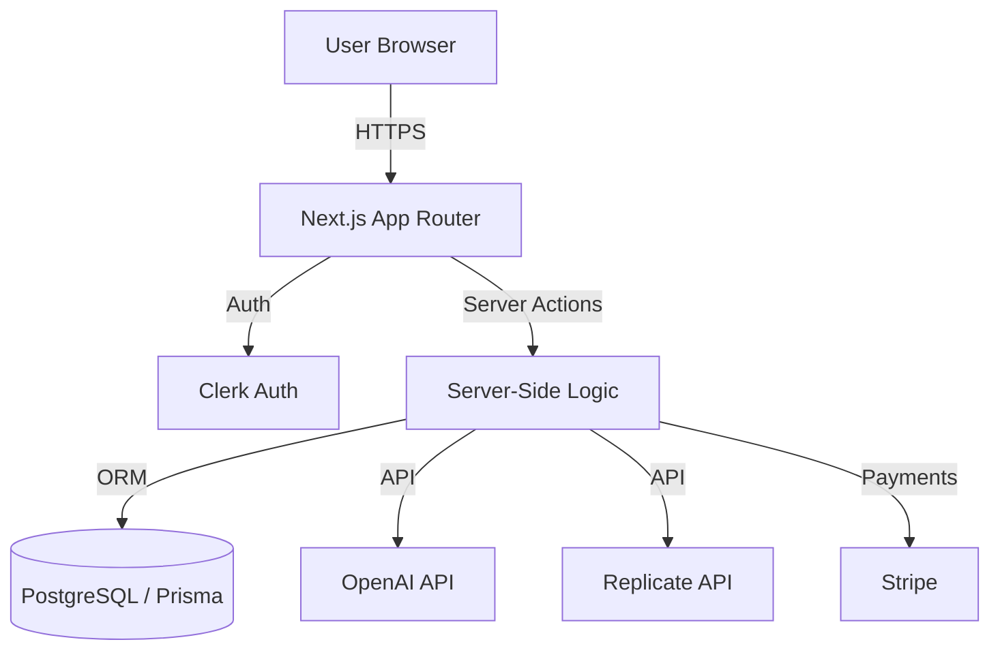

# Genius AI - Architecture & Interview Guide

This document provides a deep dive into the technical architecture of the Genius AI platform. It is designed to help you understand the system design and prepare for technical interviews.

---

## 🏗️ System Architecture

### High-Level Overview
Genius is a **Serverless SaaS Application** built on the **Next.js 14 App Router**. It leverages a "Backend-for-Frontend" (BFF) pattern using **Server Actions** to communicate securely with third-party AI APIs (OpenAI, Replicate) and the database.

### Key Components

1.  **Frontend (Client Components)**:
    -   Built with **React** and **Tailwind CSS**.
    -   Uses `use client` for interactive elements (Inputs, Modals, Players).
    -   **State Management**: React `useState` and `react-hook-form` for form handling.
    -   **UI Library**: Shadcn UI (Radix Primitives) for accessible, unstyled components.

2.  **Backend (Server Components & Actions)**:
    -   **Server Components (`page.tsx`)**: Fetch data directly from the DB (e.g., `getApiLimitCount`, `checkSubscription`) and render HTML on the server. Secure by default.
    -   **Server Actions (`actions/*.ts`)**: Handle form submissions and mutations. They run exclusively on the server, keeping API keys safe.
    -   **Middleware (`middleware.ts`)**: Intercepts requests to enforce authentication (via Clerk) and protect routes.

3.  **Database Layer**:
    -   **PostgreSQL**: Relational database for structured data.
    -   **Prisma ORM**: Type-safe database client.
    -   **Schema**:
        -   `UserApiLimit`: Tracks free usage (userId, count).
        -   `UserSubscription`: Tracks Stripe status (stripeCustomerId, stripeSubscriptionId, etc.).

---

## 🧠 Technical Deep Dive (Interview Topics)

### 1. Next.js 14 App Router & Server Actions
**Q: Why use Server Actions instead of API Routes?**
-   **A**: Server Actions allow us to call server-side functions directly from client components without manually creating an API endpoint (`/api/...`). This reduces boilerplate, improves type safety (end-to-end TypeScript), and simplifies error handling. It also progressively enhances forms (works without JS in some cases).

### 2. Authentication & Middleware
**Q: How is authentication handled?**
-   **A**: We use **Clerk** for auth. The `middleware.ts` file runs on the Edge and intercepts every request. It checks if the user has a valid session token. If not, and the route is protected, it redirects to sign-in. `auth()` helper is used in Server Actions to get the current `userId` securely.

### 3. Database & Prisma
**Q: How do we track API limits without a user table?**
-   **A**: We don't store "Users" in our DB (Clerk handles that). We only store *metadata* linked by `userId`.
    -   When a user generates content, we check `UserApiLimit` table.
    -   If a record exists, we increment `count`.
    -   If not, we create one.
    -   This "decoupled" approach is scalable and keeps our DB light.

### 4. Stripe Integration (Webhooks)
**Q: How does the subscription system work?**
-   **A**: It relies on **Webhooks**.
    1.  User clicks "Upgrade" -> Redirects to Stripe Checkout.
    2.  User pays -> Stripe sends a `checkout.session.completed` event to our `/api/webhook` endpoint.
    3.  Our webhook handler verifies the signature (security) and creates a `UserSubscription` record in Prisma.
    4.  We listen for `invoice.payment_succeeded` to extend subscriptions.
    -   *Crucial*: We never trust the client for payment status; we only trust the Stripe Webhook.

### 5. AI API Integration
**Q: How do we handle long-running AI tasks?**
-   **A**:
    -   **OpenAI (Chat/Code/Image)**: These are relatively fast, so we `await` the response in the Server Action and return it immediately.
    -   **Replicate (Video/Music)**: These can take time. We send the request and wait for the response. In a production app at scale, we might use a **Queue** (like Redis/BullMQ) to handle these asynchronously and use WebSockets/Polling to update the UI, but for this MVP, we await the response.

---

## 🗣️ Common Interview Questions & Answers

**Q: What is "Glassmorphism" and how did you implement it?**
-   **A**: Glassmorphism is a UI trend emphasizing translucency and blur. I implemented it using Tailwind's `backdrop-blur` utility and semi-transparent backgrounds (e.g., `bg-white/10`). I also used `border-white/20` to create subtle edge highlights, mimicking glass.

**Q: How did you optimize performance?**
-   **A**:
    1.  **Server Components**: Rendered heavy UI (Sidebar, Navbar) on the server to reduce JS bundle size.
    2.  **Image Optimization**: Used `next/image` for automatic resizing and format conversion (WebP).
    3.  **Edge Middleware**: Auth checks happen at the Edge (close to user) for low latency.

**Q: What was the hardest bug you faced?**
-   **A**: *Sample Answer*: "Handling the hydration mismatch in the Sidebar. The Sidebar relied on client-side state (`window` width) but was rendered on the server. I fixed it by using a `useEffect` to ensure the component only renders after the client has mounted, or by moving the responsive logic to CSS media queries to avoid the flash of unstyled content."

**Q: Why did you choose PostgreSQL over MongoDB?**
-   **A**: Our data (Subscriptions, Usage Limits) is highly structured and relational. We need strict schema enforcement and ACID transactions (especially for payments/limits) which SQL provides better than NoSQL. Prisma makes working with SQL just as easy as a document store.

---

## 📚 Study Checklist

-   [ ] Understand **Next.js App Router** file structure (`page.tsx`, `layout.tsx`, `loading.tsx`).
-   [ ] Review **Tailwind CSS** utility classes (flex, grid, gradients).
-   [ ] Read **Prisma** schema and client methods (`findUnique`, `update`, `create`).
-   [ ] Understand **HTTP Status Codes** (200, 401, 403, 500) and how we handle them.
-   [ ] Review **Stripe Webhook** security (signature verification).
